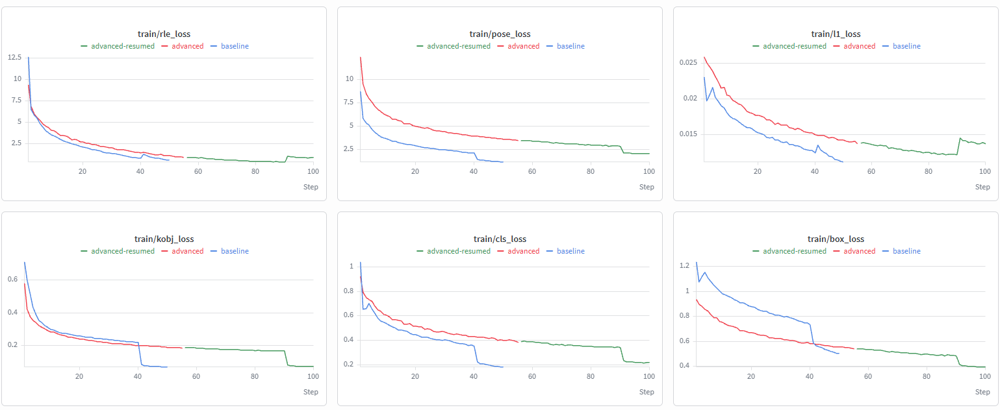
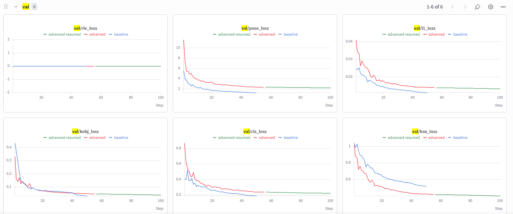

# Hand Pose Estimation Lab — YOLOv26-Pose

Fine-tuning a generic body-pose detector into a real-time **21-joint hand tracker**, and a
controlled comparison of two optimisation recipes.

📓 **[Full notebook with all results and figures → `hand_pose_lab.ipynb`](hand_pose_lab.ipynb)**

| | |
|---|---|
| 🎥 **Baseline record** | [`runs/pose/predict/failed_attempt.mp4`](runs/pose/predict/failed_attempt.mp4) — generic `yolo26n-pose` on a hand |
| 🎥 **Fine-tuned record** | [`runs/pose/predict/successful_attempt.mp4`](runs/pose/predict/successful_attempt.mp4) — 21 joints tracked at 0.94 confidence |
| 📊 **W&B dashboard** | project `hand-pose-estimation` — both runs logged together for overlay |

---

## What the task actually is

The stock `yolo26n-pose` is trained on COCO-pose: it detects a **person** and marks
**17 body keypoints**. A whole hand is represented by *one* wrist point — it has no notion
of fingers or knuckles. Fine-tuning replaces both the class (`person` → `hand`) and the
keypoint head (`kpt_shape [17,3]` → `[21,3]`).

This framing matters for reading `failed_attempt.mp4`: the generic model is **not
malfunctioning**. It detects `person` at 0.89 confidence and draws a correct body skeleton —
the "failure" is a **task mismatch**, not a broken model.

---

## 1. Hardware Profiling & Resource Metrics

| | |
|---|---|
| **Training device** | 2 × NVIDIA RTX 3090 (24 GB each) — the two runs trained **in parallel**, one per GPU |
| **Inference / recording device** | NVIDIA RTX 4050 Laptop — the desktop has no webcam, so the hybrid workflow from the lab brief was used |
| **Batch size** | `batch=16` (identical in both runs) |
| **Image size** | 640 |
| **Time per epoch** | **≈ 4.0 min** (baseline: 3.30 h / 50 epochs = 3.96 min) |
| **Total training time** | baseline **3.3 h** · advanced **≈ 6.1 h** (100 epochs; resumed once from its epoch-55 checkpoint) |
| **Dataset** | `hand-keypoints` — 18,776 train / 7,992 val images, 1 class, 21 keypoints |
| **Environment** | `uv` + `uv.lock`, Python 3.12, torch 2.11.0+cu128, ultralytics 8.4.130 |

---

## 2. Performance Tracking Metrics Ledger (Best Validated Checkpoint)

| Metric | baseline (50 ep) | advanced (100 ep) |
|---|---|---|
| **Epochs completed** | **50 / 50** | **100 / 100** (early-stop `patience=20` never triggered) |
| **Best checkpoint** | epoch 50 | epoch 100 |
| Box Loss (`box_loss`) | 0.5046 | 0.3986 |
| Pose Loss (`pose_loss`) | 1.1735 | 2.0614 |
| Class Loss (`cls_loss`) | 0.1814 | 0.2178 |
| **Pose mAP50** | **0.9025** | 0.8674 |
| **Pose mAP50-95** | **0.7624** | 0.7311 |
| Box mAP50 | 0.9923 | 0.9911 |

> ⚠️ **The loss rows are not comparable between runs.** The advanced recipe weights `pose`
> at 18 vs 12 and `box` at 5 vs 7.5, so its `pose_loss` is inflated and its `box_loss`
> deflated *by construction* — a 1.5× ratio that matches the observed gap exactly. Only the
> **validation mAP** rows compare the two models.

---

## 3. Optimization and Loss Landscape Analysis

### The two recipes

Identical data, split, seed (42), image size, batch and starting weights. The **only**
independent variable is the optimisation recipe:

| Lever | baseline | advanced | Rationale |
|---|---|---|---|
| Optimizer | auto → SGD | **AdamW**, `lr0=0.002` | per-parameter adaptive step for a fine-grained regression task; base LR cut 5× because adaptive methods amplify it themselves |
| LR schedule | linear decay | **cosine**, `warmup_epochs=4` | long soft tail to polish joint positions; extended warm-up protects the pretrained backbone from the randomly-initialised head |
| Loss weights | `pose=12, box=7.5` | **`pose=18, box=5`** | shift gradient budget away from the (easy) box toward the (target) joints |
| Augmentation | defaults | **`+ blur(p=0.15)`, `scale=0.6`** | simulate webcam motion blur and variable camera distance |
| Budget | 50 epochs | 100 epochs, `patience=20` | the cosine schedule is defined over 100 epochs |

### W&B loss curves — training vs validation

Both runs logged to a single W&B project, so the curves overlay directly. The `advanced`
run appears as two traces because it was resumed from its epoch-55 checkpoint —
`advanced` covers epochs 1–55 and `advanced-resumed` 56–100; the handoff is continuous.

**Training losses**



**Validation losses**



Three things these curves make visible:

* **The weight ratio, confirmed.** In `pose_loss` the advanced run starts at ~11.5 against
  the baseline's ~8.5, and in `box_loss` it sits *below* the baseline throughout — exactly
  the `pose 18/12` and `box 5/7.5` re-weighting. This is why the loss columns in §2 cannot
  be compared across runs.
* **The `close_mosaic` step.** The sharp drop at step 40 (baseline) and step 90 (advanced) is
  Ultralytics disabling mosaic augmentation for the final 10 epochs of each run.
* **The resume is seamless.** The green trace picks up exactly where the red one ends at
  step ~55, with no discontinuity — the per-epoch checkpoint carries weights, optimizer state
  and schedule position, so a resumed run is the same run.

### Convergence analysis

**Where did validation loss bottom out?** At the **final epoch of both runs** — epoch 50 for
baseline (`val/pose_loss` 1.2680) and epoch 100 for advanced (2.2080). Neither curve
rebounded, so **neither model overfit**, and **neither tripped the `patience=20` early stop**.
Both ran their full allocated budget and were *still improving* when it expired: the
experiment was **compute-limited, not convergence-limited**.

**The visible step near the end of each curve** is `close_mosaic`: Ultralytics disables
mosaic augmentation for the final 10 epochs, so the training distribution abruptly gets
easier and the training loss drops in a discontinuity — epoch 40 for baseline, epoch 90 for
advanced. Scheduled behaviour, not instability.

### Did the custom optimisation improve real-world tracking?

**No — and it lost consistently, across three independent evaluations.**

| Evaluation | baseline | advanced |
|---|---|---|
| Clean validation (7,992 images) — Pose mAP50 | **0.9024** | 0.8675 |
| **Blurred** validation (same images, training blur applied) | **0.8600** | 0.8370 |
| Live webcam, same scene, back-to-back — mean confidence | **0.94** | 0.92 |

**But one component did work.** The clean → blurred degradation is **−4.2 points (−4.7%)**
for baseline versus **−3.1 points (−3.5%)** for advanced. The blur augmentation delivered
exactly the robustness it was designed for: the model trained on degraded input loses less
when the input degrades.

The measurement that revealed this was missing from the brief and had to be built. The lab
asks for training under simulated webcam conditions but validates only on **clean** images —
a model trained for noise, benchmarked on no noise. [`eval_blur.py`](eval_blur.py) closes
that gap by re-validating both models on a blurred copy of the validation set, using the
same blur kernel range as training.

**Conclusion.** The blur term achieved its stated goal, while the remaining levers (AdamW at
`lr0=0.002`, the loss re-weighting) cost more accuracy than the added robustness was worth
*on this task*. A well-tuned default configuration beat an aggressively hand-tuned one.

**If continued:** the current experiment moves five levers at once. The next step is an
ablation — the advanced recipe with loss weights returned to default, and separately with a
lower `lr0` — to isolate which lever caused the regression.

---

## 4. Notes on the provided configuration

**`blur=0.15` is not a valid training argument.** The lab's Phase-2 configuration passes
`blur=0.15` to `model.train()`. Ultralytics has no such argument — its 115 training
arguments include `hsv_h/s/v`, `degrees`, `scale`, `mosaic`, `mixup` and others, but no
`blur` — and the call fails with `SyntaxError: 'blur' is not a valid YOLO argument`. The
only blur in Ultralytics lives inside its Albumentations hook, hardcoded at `A.Blur(p=0.01)`.

The stated intent ("webcam blur simulation") was therefore implemented through that hook:
`train.py` wraps the `Albumentations` transform and replaces its pipeline with
`A.Blur(p=0.15)` + `A.MedianBlur(p=0.05)`. Both are **pixel-level** transforms — they change
pixel values, not geometry — so keypoint coordinates are untouched and the pose labels stay
valid. Every other Phase-2 lever (`AdamW`, `lr0=0.002`, `cos_lr`, `warmup_epochs=4`,
`pose=18`, `box=5`, `scale=0.6`, `epochs=100`, `patience=20`) is passed exactly as specified.

**Credentials.** The W&B key lives in a git-ignored `.env` and is loaded with
`python-dotenv`, as the lab prescribes — never hardcoded, never committed.

---

## 5. Reproduce

```bash
uv sync                                              # locked environment
uv run python train.py --phase baseline --device 0   # 50 epochs, defaults
uv run python train.py --phase advanced --device 1   # 100 epochs, custom recipe
uv run python eval_blur.py                           # clean vs blurred validation
uv run python detect.py --weights none.pt --output runs/pose/predict/failed_attempt.mp4
uv run python detect.py --weights <best.pt> --output runs/pose/predict/successful_attempt.mp4
python build_notebook.py                             # regenerate the notebook
```

Create a `.env` with `WANDB_API_KEY=...` first. Datasets, weights and run directories are
git-ignored and regenerated by the commands above.

```
├── hand_pose_lab.ipynb   the lab notebook (executed, with figures)
├── train.py              both training recipes
├── detect.py             webcam inference + 8-second recorder
├── eval_blur.py          clean vs blurred validation experiment
├── build_notebook.py     rebuilds the notebook from the result files
├── results/              metrics CSVs + the exact args.yaml of both runs
└── runs/pose/predict/    the two submitted clips
```

---

## Authors

**Asaf Atia** · **Omri Simon Derai**
